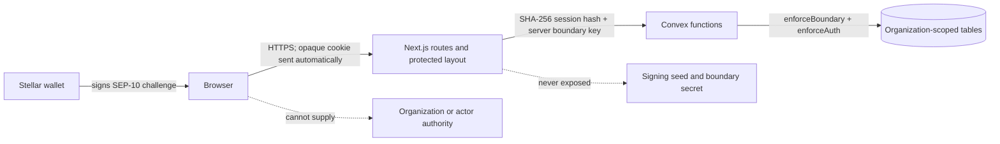

# ADR 0004: Authenticated Next.js-to-Convex boundary

Status: Accepted

Date: 2026-07-14

Supersedes: [ADR 0001](0001-sep-10-next-convex-boundary.md) for Phase 1 and later product traffic. ADR 0001 remains the historical Phase 0 decision.

## Context

Sora now authenticates Stellar wallets and stores Organization-owned application data in Convex. A Convex function is network-addressable even when the intended caller is a Next.js route, so cookie checks in middleware cannot be the data authorization boundary. The browser must not receive the raw server-to-server credential, raw session-token hashes, or a caller-selectable Organization identity.

## Decision

The browser communicates with Next.js route handlers. Next.js owns the opaque `sora_session` cookie, hashes its value with SHA-256, and sends only that hash plus the server-only `CONVEX_SERVER_BOUNDARY_KEY` to Convex. The same high-entropy boundary value is configured independently in Next.js and Convex and must never use a `NEXT_PUBLIC_` name.

Every public Convex function used by Next.js validates the boundary key. Every private data operation then calls `enforceAuth`, which resolves the session by token hash and rejects a missing, expired, revoked, deleted, disabled, or user/Organization-inconsistent identity. The returned `userId`, `walletAddress`, and `organizationId` are the only authority for downstream queries and mutations. Client bodies do not carry authoritative tenant or actor identifiers.

The protected application layout calls `getServerSession` before rendering children. Middleware checks only whether a cookie is present and may redirect early; it is an optimization, not authorization. API route handlers call `requireSessionTokenHash`, and Convex repeats the authoritative validation.

Authentication uses Sora's opaque application session rather than returning a SEP-10 JWT. SEP-10 proves wallet control; `completeAuthentication` atomically consumes the matching challenge and creates either a returning-user session plus login event or a single-use onboarding grant. `onboard` atomically consumes that grant and creates the Organization, owner user, session, and onboarding event. Session lifetime is fixed at eight hours; challenge lifetime is five minutes; onboarding-grant lifetime is fifteen minutes. Logout marks the current session `revokedAt` and clears the cookie. The cookie is `HttpOnly`, `SameSite=Lax`, path `/`, and `Secure` outside local development.

Asset routes convert failures to `{ error: { code, message, correlationId, fieldErrors? } }`. Authentication maps to 401, unavailable assets to 404, conflicts to 409, validation to 422, and recoverable service failures to 503. Foreign and nonexistent asset identifiers share `ASSET_NOT_FOUND`.

## Consequences

- A direct browser-to-Convex call lacks the boundary credential and fails before session or tenant resolution.
- A leaked or forged cookie value is insufficient unless its hash resolves to a live, internally consistent session.
- Rotating the boundary credential requires coordinated Next.js and Convex configuration changes.
- The boundary credential authenticates the Next.js caller; it does not replace per-request session validation.
- Any new Next.js-to-Convex function must accept and validate the boundary key and use `enforceAuth` before accessing private data.

## Verification anchors

- Boundary and identity checks: `packages/backend/convex/helpers.ts` (`enforceBoundary`, `enforceAuth`)
- Consolidated auth mutations: `packages/backend/convex/auth.ts`
- Cookie hashing and server-session resolution: `apps/web/core/lib/server-session.ts`
- Protected render boundary: `apps/web/app/(pages)/layout.tsx`
- Direct-call and identity-state regression tests: `packages/backend/src/convex/assets.test.ts`
