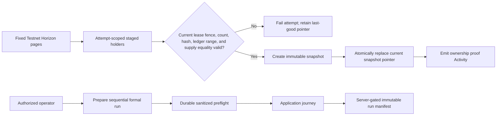

# ADR 0005: Fenced ownership publication and demo-run authority

Status: Accepted

Date: 2026-07-15

## Context

Phase 5 must publish a complete account-balance proof from paginated Horizon responses without exposing partial data, accepting a mismatched supply, or allowing a stale worker to replace newer evidence. Formal demo runs also reuse shared Testnet accounts, so arbitrary browser callers or concurrent operators must not choose run identity, asset code, fault behavior, or evidence outcome.

ADRs 0001 and 0004 establish the public Next.js-to-Convex authentication boundary. ADR 0003 establishes hash-first issuance reconciliation. None defines ownership-corpus publication, long-running ownership worker fencing, immutable proof retention, or the separate operator authority for formal release evidence.

## Decision

Ownership synchronization stages a complete, strictly ordered holder corpus under an attempt ID. One Organization-and-asset lease supplies a monotonically increasing fencing token. Every page write and the final publication mutation must hold the current unexpired fence.

The final mutation recomputes and verifies corpus count, canonical SHA-256 hash, ledger range, and exact equality between observed account units and the durable confirmed issuance units. It then creates an immutable snapshot and atomically changes the issuance's `currentOwnershipSnapshotId`. No queued, staging, failed, mismatched, or stale-fence attempt is query-visible through that pointer. A failed later attempt preserves the last good snapshot.

Current snapshots cannot be cleaned up. Formal-run snapshots are pinned. Non-current, unpinned history is bounded by count and age, while abandoned staging attempts are cleaned separately.

Formal run preparation, preflight, fault arming, and evidence finalization use a private operator boundary in addition to the server boundary. The configured demo Organization is server authority. Runs are sequential, request-idempotent, and receive server-generated UUIDs and deterministic unique asset-code candidates. The only supported fault is an allowlisted, one-shot Testnet ambiguity boundary. The browser cannot activate it.

There is no destructive demo reset. An authorized non-destructive reset may close a `Prepared` or `Active` run as `Fail` only when no issuance work is pending or submitted. It clears only an armed, unconsumed demo fault and preserves prior records and evidence. A later run receives a new namespace and asset identity; confirmed ledger effects, transaction attempts, Activity, ownership evidence, and run manifests remain append-only evidence.

## Consequences

- Readers see either the last complete reconciled proof or no proof; they never see a partial corpus as current.
- Lease expiry enables recovery without granting a stale worker publication authority.
- Publication is intentionally blocked while Horizon account supply differs from confirmed issuance supply.
- Formal evidence is coupled to one run, one unique asset identity, one Organization, and one exact release revision.
- Operator secrets remain outside the browser and evidence, but their rotation requires coordinated private configuration.
- Shared Testnet accounts require sequential runs and preflight; horizontal formal-run execution is rejected.
- Storage grows for pinned evidence and confirmed history by design. Cleanup may reclaim only unpinned, non-current history and abandoned staging data.

## Rejected alternatives

- **Update holder rows in place.** Readers could observe mixed pages or a partially refreshed denominator.
- **Publish when Horizon is merely close to confirmed supply.** This would make percentages and completeness claims non-deterministic.
- **Use lease expiry without fencing tokens.** An old worker could resume after takeover and overwrite newer work.
- **Let the browser choose run IDs, asset codes, Organization, or fault payloads.** This would weaken tenant isolation and make evidence reproducibility untrustworthy.
- **Reset by deleting prior records.** Stellar history cannot be erased, and application deletion would destroy the audit trail needed to prove repeatability.

## Verification anchors

- `packages/backend/convex/ownership.ts`
- `packages/backend/convex/ownershipWorker.ts`
- `packages/backend/src/convex/ownership.test.ts`
- `packages/backend/convex/demo.ts`
- `packages/backend/convex/demoWorker.ts`
- `packages/backend/src/convex/phase5-demo-integration.test.ts`
- [Phase 5 technical contract](../phase-5/technical-contract.md)
- [Phase 5 operator runbook](../phase-5/operator-runbook.md)
